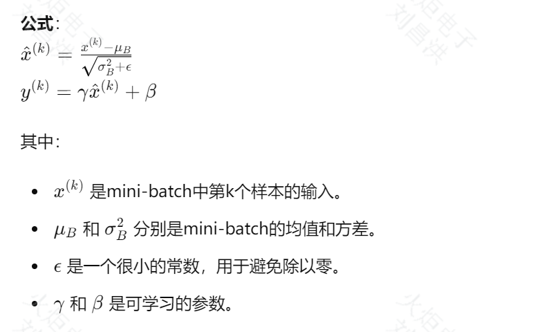
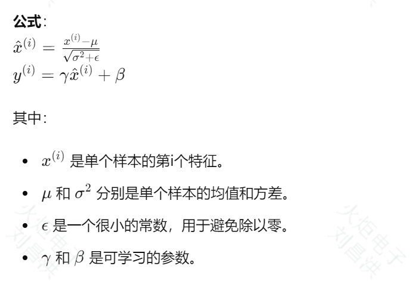

### 说明

```text
由于我是初学者,我很了解初学者什么都不懂,所以我把我的学习路程展示给大家,希望不要笑话我就可以了,XD
以下是我问gpt-4o的内容
```

---

在做transformer训练模型的时候,我的目录结构如下,我应该按照什么顺序写代码?

```structure
├── FontConfig.py
├── FontDataset.py
├── FontModel.py
└── FontTrainer.py
```

还有缺失的组件吗?

---

帮我完善以下字体训练的模型

```python
class FontModel(nn.Module):
    def __init__(self,
                 d_model=512,
                 num_head=8,
                 num_encoder_layers=2,
                 num_head_layers=1,
                 wri_decoder_layers=2,
                 gly_decoder_layers=2,
                 dim_feedforward=2048,  # 前馈神经网络中隐藏层的大小
                 dropout=0.1,
                 activation="relu",
                 normalize_before=True,  # 应用多头注意力和前馈神经网络之前是否对输入进行层归一化
                 ):
        super(FontModel, self).__init__()

    def forward(self, img):
        pass

    def inference(self):
        pass
```

---

1.对于以下2个输入图像的特征提取卷积层,哪个更好呢?
2.nn.Sequential 后面 * 是什么意思?

```python
        self.conv = nn.Sequential(
    nn.Conv2d(1, 64, kernel_size=3, stride=1, padding=1),
    nn.BatchNorm2d(64),
    nn.ReLU(inplace=True),
    nn.MaxPool2d(kernel_size=2, stride=2),
    nn.Conv2d(64, 128, kernel_size=3, stride=1, padding=1),
    nn.BatchNorm2d(128),
    nn.ReLU(inplace=True),
    nn.MaxPool2d(kernel_size=2, stride=2),
    nn.Conv2d(128, d_model, kernel_size=3, stride=1, padding=1),
    nn.BatchNorm2d(d_model),
    nn.ReLU(inplace=True)
)
```

```python
        # 此处使用一个卷积层和一个预训练的 ResNet-18 模型的特征提取器
self.Feat_Encoder = nn.Sequential(*(  # 一个输入通道，输出64个通道。卷积核大小为7，步长为2，填充为3。bias 设置为 False 表示不使用偏置项。
        [nn.Conv2d(1, 64, kernel_size=7, stride=2, padding=3, bias=False)]
        +
        # 获取了 ResNet-18 模型的子模块列表，然后去掉了列表的第一个和最后两个模块。
        # 这些被去掉的模块通常是 ResNet-18 模型的头部，包括全局平均池化层和全连接层。
        list(models.resnet18(weights=ResNet18_Weights.IMAGENET1K_V1).children())[1:-2]
))
```

---
帮我解释一下bias这儿的含义

```python
nn.Conv2d(1, 64, kernel_size=7, stride=2, padding=3, bias=False)
```

ans:
"""
bias 参数的含义
在卷积神经网络（CNN）中，每个卷积层的计算可以表示为：

output=(input ∗ filter) + bias
其中：
input 是输入张量。
filter 是卷积核（权重）。
bias 是一个可训练的偏置项。
如果 bias=True，则每个卷积核都有一个相应的偏置项bias，这个偏置项会加到卷积操作的结果上。
如果 bias=False，则卷积操作中不包含偏置项。

为什么选择 bias=False？
后续层有Batch Normalization：
通常在卷积层后面紧跟着使用批归一化层（BatchNorm），如：
nn.Conv2d(64, 128, kernel_size=3, stride=1, padding=1, bias=False),
nn.BatchNorm2d(128)
在这种情况下，偏置项的效果会被批归一化所抵消，因此可以去掉偏置项，减少参数数量和计算开销。
简化模型：
移除偏置项可以简化模型，减少需要训练的参数数量。
减少计算量：
尽管每个偏置项占用的计算资源较少，但在大模型中移除偏置项可以稍微减少计算量，尤其是在高效计算环境中。
总结
bias=False 表示在卷积操作中不使用偏置项。常见的理由包括后续使用批归一化层、简化模型以及减少计算量。具体是否使用偏置项，需要根据模型的设计和实际需求来决定。
"""

---

为什么kernel_size=7, stride=2, padding=3,这儿是怎么选取的呢?

```python
nn.Conv2d(1, 64, kernel_size=7, stride=2, padding=3, bias=False)
```

---

```python
class FontModel(nn.Module):
    def __init__(self,
                 d_model=512,
                 num_head=8,
                 num_encoder_layers=2,
                 num_head_layers=1,
                 wri_decoder_layers=2,
                 gly_decoder_layers=2,
                 dim_feedforward=2048,  # 前馈神经网络中隐藏层的大小
                 dropout=0.1,
                 activation="relu",
                 normalize_before=True,  # 应用多头注意力和前馈神经网络之前是否对输入进行层归一化
                 ):
        super(FontModel, self).__init__()

        self.Feat_Encoder = nn.Sequential(*(  # 一个输入通道，输出64个通道。卷积核大小为7，步长为2，填充为3。bias=False不使用偏置项
                [nn.Conv2d(1, 64, kernel_size=7, stride=2, padding=3, bias=False)]
                +
                list(models.resnet18(weights=ResNet18_Weights.IMAGENET1K_V1).children())[1:-2]
        ))

        # Transformer 编码器
        encoder_layers = TransformerEncoderLayer(d_model, num_head, dim_feedforward, dropout, activation)

```

```python
class TransformerEncoderLayer(nn.Module):

    def __init__(self,
                 d_model,
                 nhead,
                 dim_feedforward=2048,
                 dropout=0.1,
                 activation="relu",
                 normalize_before=False):
        super().__init__()
        self.self_attn = nn.MultiheadAttention(d_model, nhead, dropout=dropout)
        # Implementation of Feedforward model
        self.linear1 = nn.Linear(d_model, dim_feedforward)
        self.dropout = nn.Dropout(dropout)
        self.linear2 = nn.Linear(dim_feedforward, d_model)

        self.norm1 = nn.LayerNorm(d_model)
        self.norm2 = nn.LayerNorm(d_model)
        self.dropout1 = nn.Dropout(dropout)
        self.dropout2 = nn.Dropout(dropout)

        self.activation = _get_activation_fn(activation)
        self.normalize_before = normalize_before

    def with_pos_embed(self, tensor, pos: Optional[Tensor]):
        return tensor if pos is None else tensor + pos

    def forward_post(self,
                     src,
                     src_mask: Optional[Tensor] = None,
                     src_key_padding_mask: Optional[Tensor] = None,
                     pos: Optional[Tensor] = None):
        q = k = self.with_pos_embed(src, pos)
        src2 = self.self_attn(q, k, value=src, attn_mask=src_mask,
                              key_padding_mask=src_key_padding_mask)[0]
        src = src + self.dropout1(src2)
        src = self.norm1(src)
        src2 = self.linear2(self.dropout(self.activation(self.linear1(src))))
        src = src + self.dropout2(src2)
        src = self.norm2(src)
        return src

    def forward_pre(self, src,
                    src_mask: Optional[Tensor] = None,
                    src_key_padding_mask: Optional[Tensor] = None,
                    pos: Optional[Tensor] = None):
        src2 = self.norm1(src)
        q = k = self.with_pos_embed(src2, pos)
        src2 = self.self_attn(q, k, value=src2, attn_mask=src_mask,
                              key_padding_mask=src_key_padding_mask)[0]
        src = src + self.dropout1(src2)
        src2 = self.norm2(src)
        src2 = self.linear2(self.dropout(self.activation(self.linear1(src2))))
        src = src + self.dropout2(src2)
        return src

    def forward(self, src,
                src_mask: Optional[Tensor] = None,
                src_key_padding_mask: Optional[Tensor] = None,
                pos: Optional[Tensor] = None):
        if self.normalize_before:
            return self.forward_pre(src, src_mask, src_key_padding_mask, pos)
        return self.forward_post(src, src_mask, src_key_padding_mask, pos)
```

在这个模型中,TransformerEncoderLayer有自己写的如上,也有官方如下:
from torch.nn import TransformerEncoder, TransformerEncoderLayer, TransformerDecoder, TransformerDecoderLayer
那么我应该选取哪个呢?

---

```python
class TransformerEncoderLayer(nn.Module):

    def __init__(self,
                 d_model,
                 nhead,
                 dim_feedforward=2048,
                 dropout=0.1,
                 activation="relu",
                 normalize_before=False):
        super().__init__()
        self.self_attn = nn.MultiheadAttention(d_model, nhead, dropout=dropout)
        # Implementation of Feedforward model
        self.linear1 = nn.Linear(d_model, dim_feedforward)
        self.dropout = nn.Dropout(dropout)
        self.linear2 = nn.Linear(dim_feedforward, d_model)

        self.norm1 = nn.LayerNorm(d_model)
        self.norm2 = nn.LayerNorm(d_model)
        self.dropout1 = nn.Dropout(dropout)
        self.dropout2 = nn.Dropout(dropout)

        self.activation = _get_activation_fn(activation)
        self.normalize_before = normalize_before

    def with_pos_embed(self, tensor, pos: Optional[Tensor]):
        return tensor if pos is None else tensor + pos

    def forward_post(self,
                     src,
                     src_mask: Optional[Tensor] = None,
                     src_key_padding_mask: Optional[Tensor] = None,
                     pos: Optional[Tensor] = None):
        q = k = self.with_pos_embed(src, pos)
        src2 = self.self_attn(q, k, value=src, attn_mask=src_mask,
                              key_padding_mask=src_key_padding_mask)[0]
        src = src + self.dropout1(src2)
        src = self.norm1(src)
        src2 = self.linear2(self.dropout(self.activation(self.linear1(src))))
        src = src + self.dropout2(src2)
        src = self.norm2(src)
        return src

    def forward_pre(self, src,
                    src_mask: Optional[Tensor] = None,
                    src_key_padding_mask: Optional[Tensor] = None,
                    pos: Optional[Tensor] = None):
        src2 = self.norm1(src)
        q = k = self.with_pos_embed(src2, pos)
        src2 = self.self_attn(q, k, value=src2, attn_mask=src_mask,
                              key_padding_mask=src_key_padding_mask)[0]
        src = src + self.dropout1(src2)
        src2 = self.norm2(src)
        src2 = self.linear2(self.dropout(self.activation(self.linear1(src2))))
        src = src + self.dropout2(src2)
        return src

    def forward(self, src,
                src_mask: Optional[Tensor] = None,
                src_key_padding_mask: Optional[Tensor] = None,
                pos: Optional[Tensor] = None):
        if self.normalize_before:
            return self.forward_pre(src, src_mask, src_key_padding_mask, pos)
        return self.forward_post(src, src_mask, src_key_padding_mask, pos)
```

normalize_before=True的时候会
return self.forward_pre(src, src_mask, src_key_padding_mask, pos)
这是在做什么?

--- 
LayerNorm和BatchNorm是什么呢?到底

ans:

```text
Batch Normalization 在2015年由Sergey Ioffe和Christian Szegedy提出。
它通过对小批量数据（mini-batch）进行归一化处理来稳定和加速深度神经网络的训练。
主要步骤：
对每个mini-batch计算均值和方差。
将每个mini-batch内的激活值减去均值并除以标准差进行归一化。
引入两个可学习的参数，缩放参数 γ 和 平移参数 β，对归一化后的值进行线性变换，恢复网络的表达能力。
```



```text
Layer Normalization 是由Jimmy Ba和Diederik P. Kingma在2016年提出的一种归一化方法。
它在每个训练样本上进行归一化，而不是在mini-batch上进行归一化。
主要步骤：
对每个训练样本的所有特征计算均值和方差。
将每个训练样本的激活值减去均值并除以标准差进行归一化。
引入两个可学习的参数，缩放参数 γ 和 平移参数 β，对归一化后的值进行线性变换，恢复网络的表达能力。
```



```text
BatchNorm：主要用于CNN中，处理图像等数据的批量训练时效果显著。
LayerNorm：主要用于RNN和Transformer中，处理序列数据或需要逐样本归一化时效果更好。
```

---

```python
class FontModel(nn.Module):
    def __init__(self,
                 d_model=512,
                 num_head=8,
                 num_encoder_layers=2,
                 num_head_layers=1,
                 num_wri_decoder_layers=2,
                 num_gly_decoder_layers=2,
                 dim_feedforward=2048,  # 前馈神经网络中隐藏层的大小
                 dropout=0.1,
                 activation="relu",
                 normalize_before=True,  # 应用多头注意力和前馈神经网络之前是否对输入进行层归一化
                 ):
        super(FontModel, self).__init__()

        # 图像的特征提取卷积层
        # 此处使用一个卷积层和一个预训练的 ResNet-18 模型的特征提取器
        # *() 将列表中的元素作为多个参数传递给 nn.Sequential，而不是将整个列表作为一个参数
        self.Feat_Encoder = nn.Sequential(*(  # 一个输入通道，输出64个通道。卷积核大小为7，步长为2，填充为3。bias=False不使用偏置项
                [nn.Conv2d(1, 64, kernel_size=7, stride=2, padding=3, bias=False)]
                +
                # 获取了 ResNet-18 模型的子模块列表，然后去掉了列表的第一个和最后两个模块。
                # 这些被去掉的模块通常是 ResNet-18 模型的头部，包括全局平均池化层和全连接层。
                list(models.resnet18(weights=ResNet18_Weights.IMAGENET1K_V1).children())[1:-2]
        ))

        # Transformer 编码器
        encoder_layers = TransformerEncoderLayer(
            d_model, num_head, dim_feedforward, dropout, activation, normalize_before
        )
        self.base_encoder = TransformerEncoder(encoder_layers, num_encoder_layers)

        # 风格特征编码器
        writer_norm = nn.LayerNorm(d_model) if normalize_before else None
        glyph_norm = nn.LayerNorm(d_model) if normalize_before else None
        self.writer_encoder = TransformerEncoder(encoder_layers, num_head_layers, writer_norm)
        self.glyph_encoder = TransformerEncoder(encoder_layers, num_head_layers, glyph_norm)
```

```python
class TransformerEncoder(nn.Module):

    def __init__(self, encoder_layer, num_layers, norm=None):
        super().__init__()
        self.layers = _get_clones(encoder_layer, num_layers)
        self.num_layers = num_layers
        self.norm = norm
```

writer_encoder,glyph_encoder定义没理解,帮我细致解释一下

ans:

```text
TransformerEncoderLayer
这是一个Transformer编码器层，包括：
多头自注意力机制：允许模型关注输入序列的不同部分。
前馈神经网络：逐位置的全连接前馈网络。
层归一化和Dropout：用于稳定和正则化网络。

TransformerEncoder
这个类将多个TransformerEncoderLayer实例堆叠在一起：
layers：一个TransformerEncoderLayer实例的列表。
num_layers：编码器中的层数。
norm：可选的输出层归一化。
```

为什么在定义writer_encoder和glyph_encoder时使用了之前定义的encoder_layers?
而不是为每个编码器单独定义新的TransformerEncoderLayer。

---

```python
class Content_TR(nn.Module):
    def __init__(self,
                 d_model=256,
                 nhead=8,
                 num_encoder_layers=3,
                 dim_feedforward=2048,
                 dropout=0.1,
                 activation="relu",
                 normalize_before=True
                 ):
        super(Content_TR, self).__init__()
        self.Feat_Encoder = nn.Sequential(*(
                [nn.Conv2d(1, 64, kernel_size=7, stride=2, padding=3, bias=False)]
                +
                list(models.resnet18(weights=ResNet18_Weights.IMAGENET1K_V1).children())[1:-2]
        ))
        encoder_layer = TransformerEncoderLayer(
            d_model, nhead, dim_feedforward, dropout, activation, normalize_before
        )
        encoder_norm = nn.LayerNorm(d_model) if normalize_before else None
        self.add_position = PositionalEncoding(dropout=0.1, dim=d_model)
        self.encoder = TransformerEncoder(encoder_layer, num_encoder_layers, norm=encoder_norm)

    def forward(self, x):
        x = self.Feat_Encoder(x)
        x = rearrange(x, 'n c h w -> (h w) n c')
        x = self.add_position(x)
        x = self.encoder(x)
        return x
```

```python
class FontModel(nn.Module):
    def __init__(self,
                 d_model=512,
                 num_head=8,
                 num_encoder_layers=2,
                 num_writer_layers=1,
                 num_glyph_layers=1,
                 num_wri_decoder_layers=2,
                 num_gly_decoder_layers=2,
                 dim_feedforward=2048,  # 前馈神经网络中隐藏层的大小
                 dropout=0.1,
                 activation="relu",
                 normalize_before=True,  # 应用多头注意力和前馈神经网络之前是否对输入进行层归一化
                 ):
        super(FontModel, self).__init__()

        # 图像的特征提取卷积层
        # 此处使用一个卷积层和一个预训练的 ResNet-18 模型的特征提取器
        # *() 将列表中的元素作为多个参数传递给 nn.Sequential，而不是将整个列表作为一个参数
        self.Feat_Encoder = nn.Sequential(*(  # 一个输入通道，输出64个通道。卷积核大小为7，步长为2，填充为3。bias=False不使用偏置项
                [nn.Conv2d(1, 64, kernel_size=7, stride=2, padding=3, bias=False)]
                +
                # 获取了 ResNet-18 模型的子模块列表，然后去掉了列表的第一个和最后两个模块。
                # 这些被去掉的模块通常是 ResNet-18 模型的头部，包括全局平均池化层和全连接层。
                list(models.resnet18(weights=ResNet18_Weights.IMAGENET1K_V1).children())[1:-2]
        ))

        # Transformer 编码器
        encoder_layer = TransformerEncoderLayer(
            d_model, num_head, dim_feedforward, dropout, activation, normalize_before
        )
        self.base_encoder = TransformerEncoder(encoder_layer, num_encoder_layers)

        # 风格特征编码器
        writer_norm = nn.LayerNorm(d_model) if normalize_before else None
        glyph_norm = nn.LayerNorm(d_model) if normalize_before else None
        self.writer_encoder = TransformerEncoder(encoder_layer, num_writer_layers, writer_norm)
        self.glyph_encoder = TransformerEncoder(encoder_layer, num_glyph_layers, glyph_norm)

        # 内容编码器 用于对输入的内容进行编码，以提取内容信息。
        self.content_encoder = Content_TR(d_model, num_encoder_layers)
```

为什么还需要加一个content_encoder呢?

---

```python
class FontModel(nn.Module):
    def __init__(self,
                 d_model=512,
                 num_head=8,
                 num_encoder_layers=2,
                 num_writer_encoder_layers=1,
                 num_glyph_encoder_layers=1,
                 num_wri_decoder_layers=2,
                 num_gly_decoder_layers=2,
                 dim_feedforward=2048,  # 前馈神经网络中隐藏层的大小
                 dropout=0.1,
                 activation="relu",
                 normalize_before=True,  # 应用多头注意力和前馈神经网络之前是否对输入进行层归一化
                 return_intermediate_dec=True,  # 是否在解码过程中返回中间结果
                 ):
        super(FontModel, self).__init__()

        # 图像的特征提取卷积层
        # 此处使用一个卷积层和一个预训练的 ResNet-18 模型的特征提取器
        # *() 将列表中的元素作为多个参数传递给 nn.Sequential，而不是将整个列表作为一个参数
        self.feat_encoder = nn.Sequential(*(  # 一个输入通道，输出64个通道。卷积核大小为7，步长为2，填充为3。bias=False不使用偏置项
                [nn.Conv2d(1, 64, kernel_size=7, stride=2, padding=3, bias=False)]
                +
                # 获取了 ResNet-18 模型的子模块列表，然后去掉了列表的第一个和最后两个模块。
                # 这些被去掉的模块通常是 ResNet-18 模型的头部，包括全局平均池化层和全连接层。
                list(models.resnet18(weights=ResNet18_Weights.IMAGENET1K_V1).children())[1:-2]
        ))

        # Transformer 编码器
        encoder_layer = TransformerEncoderLayer(
            d_model, num_head, dim_feedforward, dropout, activation, normalize_before
        )
        self.base_encoder = TransformerEncoder(encoder_layer, num_encoder_layers)

        # 风格特征编码器
        writer_norm = nn.LayerNorm(d_model) if normalize_before else None
        glyph_norm = nn.LayerNorm(d_model) if normalize_before else None
        self.writer_encoder = TransformerEncoder(encoder_layer, num_writer_encoder_layers, writer_norm)
        self.glyph_encoder = TransformerEncoder(encoder_layer, num_glyph_encoder_layers, glyph_norm)

        # 内容编码器 用于对输入的内容进行编码，以提取内容信息。
        self.content_encoder = Content_TR(
            d_model=d_model, num_encoder_layers=num_encoder_layers
        )

        # 风格特征解码器
        writer_decoder_layers = TransformerDecoderLayer(
            d_model, num_head, dim_feedforward, dropout, activation
        )
        glyph_decoder_layers = TransformerDecoderLayer(
            d_model, num_head, dim_feedforward, dropout, activation
        )
        self.writer_transformer_decoder = TransformerDecoder(
            writer_decoder_layers, num_wri_decoder_layers
        )
        self.glyph_transformer_decoder = TransformerDecoder(
            glyph_decoder_layers, num_gly_decoder_layers
        )
```

为什么在定义writer_encoder和glyph_encoder时使用了之前定义的encoder_layers?
解码器这儿却每个都有自己的呢?

---

```python
self.pro_mlp_writer = nn.Sequential(
    nn.Linear(512, 4096),
    nn.GELU(),
    nn.Linear(4096, 256)
)
self.pro_mlp_character = nn.Sequential(
    nn.Linear(512, 4096),
    nn.GELU(),
    nn.Linear(4096, 256)
)
```

这个有什么作用呢?

---

如果增加了这个多层感知器,还需要增加self.fc_out = nn.Linear(d_model, 256) 吗?

---
这个写法如果展开是什么呢?

```python
self.pro_mlp_writer = nn.Sequential(
    nn.Linear(512, 4096),
    nn.GELU(),
    nn.Linear(4096, 256)
)
```

ans:
"""
展开后的写法将每一层单独定义，并在 forward 方法中显式调用：
class FontModel(nn.Module):
def __init__(self, d_model=512, ...):
super(FontModel, self).__init__()
...
# 定义各个层
self.fc1 = nn.Linear(512, 4096)
self.gelu = nn.GELU()
self.fc2 = nn.Linear(4096, 256)
...

    def forward(self, x):
        ...
        # 显式调用每一层
        x = self.fc1(x)
        x = self.gelu(x)
        writer_features = self.fc2(x)
        ...
        return writer_features
        ...

"""

---

```python
class SeqtoEmb(nn.Module):
    def __init__(self, input_dim, dropout=0.1):
        super().__init__()
        self.fc_1 = nn.Linear(5, 256)
        self.fc_2 = nn.Linear(256, input_dim)
        self.dropout = nn.Dropout(dropout)

    def forward(self, seq):
        x = self.dropout(torch.relu(self.fc_1(seq)))
        x = self.fc_2(x)
        return x


class EmbtoSeq(nn.Module):
    def __init__(self, input_dim, dropout=0.1):
        super().__init__()
        self.fc_1 = nn.Linear(input_dim, 256)
        self.fc_2 = nn.Linear(256, 123)
        self.dropout = nn.Dropout(dropout)

    def forward(self, seq):
        x = self.dropout(torch.relu(self.fc_1(seq)))
        x = self.fc_2(x)
        return x
```

下面2个模块有什么用?
self.SeqtoEmb = SeqtoEmb(input_dim=d_model)
self.EmbtoSeq = EmbtoSeq(input_dim=d_model)

---

```python
class FontModel(nn.Module):
    def __init__(self,
                 d_model=512,
                 num_head=8,
                 num_encoder_layers=2,
                 num_writer_encoder_layers=1,
                 num_glyph_encoder_layers=1,
                 num_wri_decoder_layers=2,
                 num_gly_decoder_layers=2,
                 dim_feedforward=2048,  # 前馈神经网络中隐藏层的大小
                 dropout=0.1,
                 activation="relu",
                 normalize_before=True,  # 应用多头注意力和前馈神经网络之前是否对输入进行层归一化
                 return_intermediate_dec=True,  # 是否在解码过程中返回中间结果
                 ):
        super(FontModel, self).__init__()

        # 图像的特征提取卷积层
        # 此处使用一个卷积层和一个预训练的 ResNet-18 模型的特征提取器
        # *() 将列表中的元素作为多个参数传递给 nn.Sequential，而不是将整个列表作为一个参数
        self.feat_encoder = nn.Sequential(*(  # 一个输入通道，输出64个通道。卷积核大小为7，步长为2，填充为3。bias=False不使用偏置项
                [nn.Conv2d(1, 64, kernel_size=7, stride=2, padding=3, bias=False)]
                +
                # 获取了 ResNet-18 模型的子模块列表，然后去掉了列表的第一个和最后两个模块。
                # 这些被去掉的模块通常是 ResNet-18 模型的头部，包括全局平均池化层和全连接层。
                list(models.resnet18(weights=ResNet18_Weights.IMAGENET1K_V1).children())[1:-2]
        ))

        # Transformer 编码器
        encoder_layer = TransformerEncoderLayer(
            d_model, num_head, dim_feedforward, dropout, activation, normalize_before
        )
        self.base_encoder = TransformerEncoder(encoder_layer, num_encoder_layers)

        # 风格特征编码器
        writer_norm = nn.LayerNorm(d_model) if normalize_before else None
        glyph_norm = nn.LayerNorm(d_model) if normalize_before else None
        self.writer_encoder = TransformerEncoder(encoder_layer, num_writer_encoder_layers, writer_norm)
        self.glyph_encoder = TransformerEncoder(encoder_layer, num_glyph_encoder_layers, glyph_norm)

        # 内容编码器 用于对输入的内容进行编码，以提取内容信息。
        self.content_encoder = Content_TR(
            d_model=d_model, num_encoder_layers=num_encoder_layers
        )

        # 风格特征解码器
        writer_decoder_layers = TransformerDecoderLayer(
            d_model, num_head, dim_feedforward, dropout, activation
        )
        glyph_decoder_layers = TransformerDecoderLayer(
            d_model, num_head, dim_feedforward, dropout, activation
        )
        self.writer_transformer_decoder = TransformerDecoder(
            writer_decoder_layers, num_wri_decoder_layers
        )
        self.glyph_transformer_decoder = TransformerDecoder(
            glyph_decoder_layers, num_gly_decoder_layers
        )

        self.pro_mlp_writer = nn.Sequential(
            nn.Linear(512, 4096),
            nn.GELU(),
            nn.Linear(4096, 256)
        )
        self.pro_mlp_character = nn.Sequential(
            nn.Linear(512, 4096),
            nn.GELU(),
            nn.Linear(4096, 256)
        )

        self.SeqtoEmb = SeqtoEmb(output_dim=d_model)
        self.EmbtoSeq = EmbtoSeq(input_dim=d_model)
        self.add_position = PositionalEncoding(dim=d_model, dropout=0.1)
        # 参数重置 用于初始化模型的参数
        self._reset_parameters()

    def _reset_parameters(self):
        for p in self.parameters():
            if p.dim() > 1:
                nn.init.xavier_uniform_(p)
```

在FontModel模型的定义中,self._reset_parameters()有必要吗?他这句话在什么时候执行呢?

ans:
"""
在 FontModel 的构造函数 __init__ 中，
self._reset_parameters() 会在所有层和模块定义完成后立即执行。
这是因为构造函数会在创建 FontModel 对象时自动调用，确保模型参数在模型创建时被正确初始化。
执行流程:
调用构造函数: 创建 FontModel 对象时，例如 model = FontModel()，会调用 __init__ 方法。
定义模型结构: __init__ 方法定义模型的所有层和模块，包括卷积层、Transformer 编码器和解码器等。
初始化参数: 定义完成后，self._reset_parameters() 被调用，以便为模型中的所有参数执行初始化。
"""